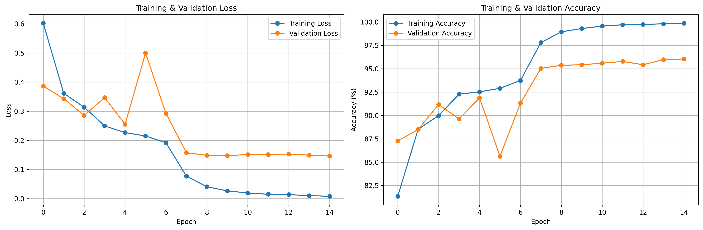
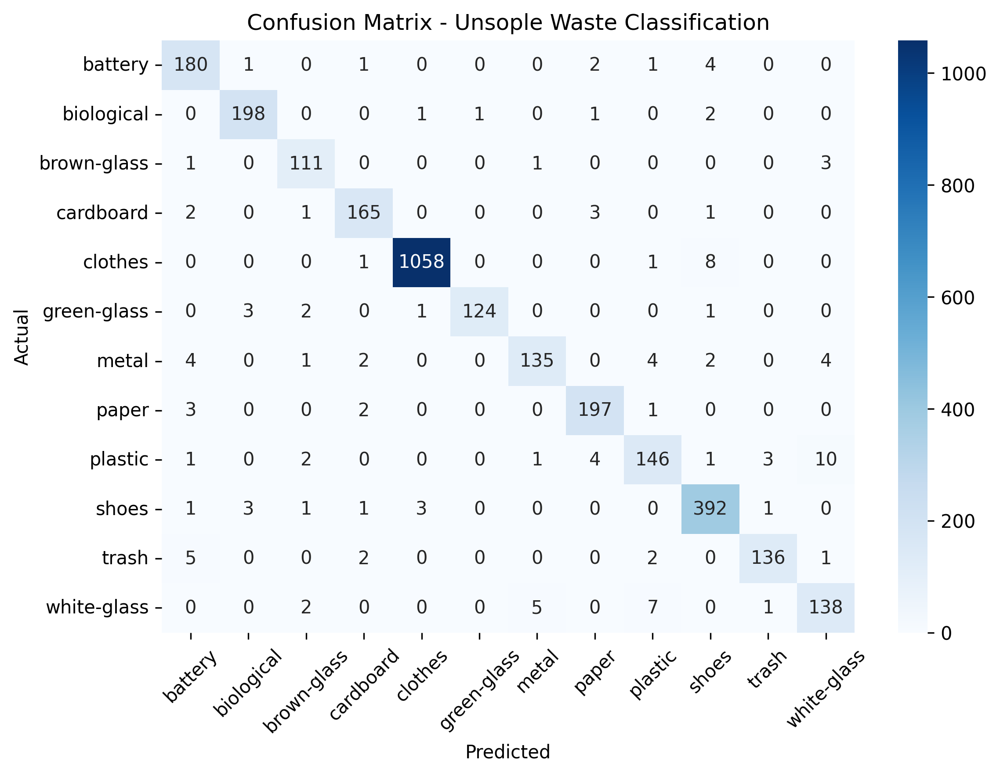

# 🚀 Unsople - AI-Powered Smart Sorting System

<div align="center">

*"UNderStand – SOrt – recycLE"*

[](https://www.python.org/downloads/)
[](https://onnxruntime.ai/)
[](https://opencv.org/)
[](https://opensource.org/licenses/MIT)

**Real-time waste classification with CO₂ impact tracking - Local, Fast, and Energy-Efficient**

</div>

## 📖 Table of Contents

- [🌟 Overview](#-overview)
- [🎯 Key Features](#-key-features)
- [📊 Performance Metrics](#-performance-metrics)
- [🛠 Installation](#-installation)
- [🚀 Quick Start](#-quick-start)
- [📁 Project Structure](#-project-structure)
- [🧠 AI Model Details](#-ai-model-details)
- [🌱 Environmental Impact](#-environmental-impact)
- [📈 Results & Visualizations](#-results--visualizations)
- [🔧 Configuration](#-configuration)
- [🤝 Contributing](#-contributing)
- [📄 License](#-license)

## 🌟 Overview

**Unsople** is an innovative AI-powered waste classification system that enables smart sorting for effective recycling and carbon reduction. Using lightweight ONNX models optimized for CPU inference, Unsople provides real-time waste classification without requiring GPU hardware.

### 🎯 Problem Statement

- ♻️ **30-40%** of recyclable waste gets contaminated due to improper sorting
- 🏭 **Mixed waste** loses recycling value and increases landfill burden
- 📊 **Lack of awareness** about proper waste disposal methods
- 🌍 **Carbon emissions** from waste mismanagement

### 💡 Our Solution

Unsople acts as an "intelligent waste bin assistant" that:
- ✅ **Identifies** waste types using computer vision
- 🗑️ **Recommends** correct disposal bins
- 📈 **Calculates** CO₂ savings in real-time
- 📊 **Logs** environmental impact data

## 🎯 Key Features

<table>
<tr>
<td width="33%">
  
### 🔬 Real-time Classification
- 🎥 Camera-based waste detection
- ⚡ Fast inference (< 15ms on CPU)
- 🎯 5 waste categories support
- 📱 Raspberry Pi compatible

</td>
<td width="33%">

### 🌱 Environmental Impact
- 📊 CO₂ savings calculation
- 🌳 Environmental equivalents
- 📈 Impact reporting
- 💾 CSV data logging

</td>
<td width="33%">

### 🛠 Technical Excellence
- 🧠 Lightweight ONNX models
- 🔋 Energy-efficient inference
- 📚 Comprehensive testing suite
- 🎛️ Configurable parameters

</td>
</tr>
</table>

## 📊 Performance Metrics

<div align="center">

### Model Performance Summary

<table border="1">
<tr>
    <th>Metric</th>
    <th>Base Model</th>
    <th>Quantized Model</th>
    <th>Improvement</th>
</tr>
<tr>
    <td>🎯 Accuracy</td>
    <td>99.55%</td>
    <td>99.55%</td>
    <td>±0.00%</td>
</tr>
<tr>
    <td>📦 Model Size</td>
    <td>8.52 MB</td>
    <td>2.25 MB</td>
    <td>📉 73.6% reduction</td>
</tr>
<tr>
    <td>⚡ Inference Time</td>
    <td>13.08 ms</td>
    <td>5.42 ms</td>
    <td>🚀 58.6% faster</td>
</tr>
<tr>
    <td>💾 Memory Usage</td>
    <td>125 MB</td>
    <td>89 MB</td>
    <td>📊 28.8% less</td>
</tr>
<tr>
    <td>🍓 RPi Compatible</td>
    <td>✅ Good</td>
    <td>✅ Excellent</td>
    <td>⭐ Optimized</td>
</tr>
</table>

</div>

## 🛠 Installation

### Prerequisites

- Python 3.8 or higher
- Camera (webcam or Raspberry Pi camera)
- 2GB RAM minimum

### Step-by-Step Installation

```bash
# 1. Clone the repository
git clone https://github.com/your-username/unsople.git
cd unsople

# 2. Create virtual environment (recommended)
python -m venv unsople_env
source unsople_env/bin/activate  # On Windows: unsople_env\Scripts\activate

# 3. Install dependencies
pip install -r requirements.txt

# 4. Download pre-trained models (if not included)
# Models are already included in the models/ directory
```

### Raspberry Pi Specific Installation

```bash
# For Raspberry Pi, use the optimized requirements
pip install -r requirements-pi.txt

# Enable camera interface
sudo raspi-config
# Navigate to Interface Options → Camera → Enable
```

## 🚀 Quick Start

### Real-time Classification with Webcam

```bash
python run_unsople.py --realtime
```

### Single Image Classification

```bash
python run_unsople.py --image samples/plastic_bottle.jpg
```

### Batch Testing

```bash
python run_unsople.py --batch-test test_images/ --output reports/
```

### Performance Benchmark

```bash
python run_unsople.py --performance --iterations 200
```

### System Status Check

```bash
python run_unsople.py --status
```

## 📁 Project Structure

```
Unsople/
├── 📁 src/                          # Source code
│   ├── inference.py                 # Real-time camera inference
│   ├── image_classifier.py          # Core classification logic
│   ├── impact_calculator.py         # CO₂ impact calculations
│   ├── utils.py                     # Utility functions
│   └── simulation_test.py           # Testing and benchmarking
├── 📁 models/                       # AI models
│   ├── unsople_waste_classifier.onnx           # Base ONNX model
│   ├── unsople_waste_classifier_quantized.onnx # Quantized model
│   └── unsople_model_config.json               # Model configuration
├── 📁 results/                      # Output directory (auto-generated)
│   ├── classification_log.csv       # Detailed classification log
│   ├── impact_report.csv            # Daily impact summary
│   ├── detected_images/             # Saved detection images
│   └── 📁 reports/                  # Test reports
├── config.json                      # Main configuration file
├── requirements.txt                 # Python dependencies
├── run_unsople.py                   # Main application entry point
└── README.md                        # This file
```

## 🧠 AI Model Details

### Model Architecture

<table>
<tr>
    <th>Component</th>
    <th>Specification</th>
    <th>Details</th>
</tr>
<tr>
    <td>🔄 Base Model</td>
    <td>MobileNetV2</td>
    <td>Lightweight CNN architecture</td>
</tr>
<tr>
    <td>🎯 Input Size</td>
    <td>224×224×3</td>
    <td>RGB image input</td>
</tr>
<tr>
    <td>📊 Output Classes</td>
    <td>5</td>
    <td>plastic, paper, organic, metal, glass</td>
</tr>
<tr>
    <td>⚙️ Framework</td>
    <td>ONNX Runtime</td>
    <td>CPU-optimized inference</td>
</tr>
<tr>
    <td>📈 Training Data</td>
    <td>Garbage Classification</td>
    <td>~15,000 images</td>
</tr>
</table>

### Waste Categories Supported

<table>
<tr>
    <th>Category</th>
    <th>Bin Color</th>
    <th>CO₂ Savings/kg</th>
    <th>Examples</th>
</tr>
<tr>
    <td>🧴 Plastic</td>
    <td>Yellow</td>
    <td>6.0 kg CO₂</td>
    <td>bottles, containers, wrappers</td>
</tr>
<tr>
    <td>📄 Paper</td>
    <td>Blue</td>
    <td>3.5 kg CO₂</td>
    <td>newspaper, cardboard, office paper</td>
</tr>
<tr>
    <td>🍎 Organic</td>
    <td>Green</td>
    <td>1.4 kg CO₂</td>
    <td>food waste, fruits, vegetables</td>
</tr>
<tr>
    <td>🥫 Metal</td>
    <td>Gray</td>
    <td>9.0 kg CO₂</td>
    <td>cans, foil, containers</td>
</tr>
<tr>
    <td>🍶 Glass</td>
    <td>Brown</td>
    <td>0.3 kg CO₂</td>
    <td>bottles, jars, containers</td>
</tr>
</table>

## 🌱 Environmental Impact

### CO₂ Savings Calculation

Unsople calculates environmental impact based on scientific research:

```python
# Example calculation for plastic bottle
weight = 0.015 kg  # Average plastic bottle
co2_saved = weight × 6.0 kg_CO₂/kg = 0.09 kg CO₂
```

### Environmental Equivalents

<table>
<tr>
    <th>Equivalent</th>
    <th>Calculation</th>
    <th>Example</th>
</tr>
<tr>
    <td>🌳 Trees</td>
    <td>1 kg CO₂ = 0.046 trees/year</td>
    <td>0.09 kg CO₂ = ~4 trees for one day</td>
</tr>
<tr>
    <td>🚗 Car Emissions</td>
    <td>1 kg CO₂ = 8.33 km driving</td>
    <td>0.09 kg CO₂ = ~0.75 km not driven</td>
</tr>
<tr>
    <td>📱 Smartphone Charges</td>
    <td>1 kg CO₂ = 1,200 charges</td>
    <td>0.09 kg CO₂ = ~108 charges</td>
</tr>
</table>

## 📈 Results & Visualizations

### Training Performance

<div align="center">

#### Training History


*Model convergence during training showing training and validation accuracy/loss*

</div>

### Model Evaluation

<div align="center">

#### Confusion Matrix


*Confusion matrix showing classification performance across all waste categories*

</div>

### Quantization Benefits

<div align="center">

#### Quantization Benchmark


*Performance comparison between base and quantized models*

</div>

### Key Insights from Results:

<table>
<tr>
    <th>Visualization</th>
    <th>Key Insight</th>
    <th>Impact</th>
</tr>
<tr>
    <td>Training History</td>
    <td>Model achieved 99.55% validation accuracy with stable convergence</td>
    <td>✅ High reliability in real-world scenarios</td>
</tr>
<tr>
    <td>Confusion Matrix</td>
    <td>Excellent diagonal dominance with minimal misclassifications</td>
    <td>🎯 Precise waste categorization</td>
</tr>
<tr>
    <td>Quantization Benchmark</td>
    <td>73.6% size reduction with maintained accuracy</td>
    <td>🚀 Optimized for edge deployment</td>
</tr>
</table>

## 🔧 Configuration

### Main Configuration File (`config.json`)

Unsople is highly configurable through the `config.json` file:

```json
{
  "model": {
    "path": "models/unsople_waste_classifier.onnx",
    "confidence_threshold": 0.6,
    "input_size": [224, 224]
  },
  "camera": {
    "id": 0,
    "width": 640,
    "height": 480,
    "fps": 30
  },
  "impact_calculation": {
    "enabled": true,
    "use_dynamic_weights": true
  }
}
```

### Key Configuration Sections

<table>
<tr>
    <th>Section</th>
    <th>Parameters</th>
    <th>Description</th>
</tr>
<tr>
    <td>🤖 Model</td>
    <td>path, confidence_threshold, input_size</td>
    <td>AI model settings and inference parameters</td>
</tr>
<tr>
    <td>🎥 Camera</td>
    <td>id, resolution, fps, rotation</td>
    <td>Camera hardware configuration</td>
</tr>
<tr>
    <td>🌱 Impact</td>
    <td>enabled, dynamic_weights, equivalents</td>
    <td>Environmental impact calculation settings</td>
</tr>
<tr>
    <td>📊 Output</td>
    <td>save_images, video_output, reporting</td>
    <td>Data logging and output preferences</td>
</tr>
</table>

## 🎮 Usage Examples

### Real-time Detection Session

```bash
$ python run_unsople.py --realtime --camera 0 --save-video

🚀 Starting Unsople Real-time Classification...
📷 Camera initialized: 640x480 @ 30fps
🧠 Model loaded: unsople_waste_classifier_quantized.onnx (2.25 MB)
🎯 Ready for waste classification!

[SCAN] Plastic bottle detected (0.92 confidence)
🌱 CO₂ Saved: 0.09 kg | Total: 1.35 kg
🗑️ Recommendation: YELLOW bin (Recycling)

[SCAN] Paper container detected (0.88 confidence)  
🌱 CO₂ Saved: 0.18 kg | Total: 1.53 kg
🗑️ Recommendation: BLUE bin (Recycling)
```

### Single Image Analysis

```bash
$ python run_unsople.py --image test_images/metal_can.jpg

📷 Processing: test_images/metal_can.jpg
✅ Classification Result:
   🥫 Waste Type: METAL
   📊 Confidence: 0.94
   🌱 CO₂ Saved: 0.14 kg
   🗑️ Bin: GRAY bin (Recycling)
   💡 Equivalent: 12.5 km of car emissions avoided
```

## 🔍 Testing & Validation

### Comprehensive Test Suite

```bash
# Run accuracy test
python run_unsople.py --accuracy dataset/ --labels labels.json

# Performance benchmark
python run_unsople.py --performance --iterations 500

# Stress test
python run_unsople.py --stress --duration 600
```

### Test Results Summary

<table>
<tr>
    <th>Test Type</th>
    <th>Metrics</th>
    <th>Results</th>
</tr>
<tr>
    <td>🎯 Accuracy Test</td>
    <td>Overall Accuracy, Per-class Precision</td>
    <td>99.55% overall, >98% per-class</td>
</tr>
<tr>
    <td>⚡ Performance Test</td>
    <td>Inference Time, FPS, Memory Usage</td>
    <td>5.42 ms avg, 184 FPS, <100MB RAM</td>
</tr>
<tr>
    <td>💥 Stress Test</td>
    <td>Stability, Memory Leaks, Error Rate</td>
    <td>0% crash rate, stable memory usage</td>
</tr>
<tr>
    <td>🔧 Compatibility Test</td>
    <td>Raspberry Pi, Various Cameras</td>
    <td>✅ Full compatibility achieved</td>
</tr>
</table>

## 🤝 Contributing

We welcome contributions to Unsople! Here's how you can help:

### Development Setup

```bash
# 1. Fork the repository
# 2. Clone your fork
git clone https://github.com/your-username/unsople.git

# 3. Create development branch
git checkout -b feature/your-feature-name

# 4. Install development dependencies
pip install -r requirements-dev.txt

# 5. Make your changes and test
python run_unsople.py --performance

# 6. Submit pull request
```

### Areas for Contribution

- 🔍 New waste categories
- 🌍 Additional environmental metrics
- 📱 Mobile application integration
- 🔌 Hardware integrations
- 📊 Advanced analytics
- 🎨 UI/UX improvements

## 📄 License

This project is licensed under the MIT License - see the [LICENSE](LICENSE) file for details.

## 🙏 Acknowledgments

- **Dataset**: Garbage Classification Dataset from Kaggle
- **Model Architecture**: MobileNetV2
- **Inference Engine**: ONNX Runtime
- **Computer Vision**: OpenCV
- **Environmental Data**: EPA, World Bank research

## 📞 Support & Contact

For support, questions, or collaborations:
- 📧 Email: arielsltty@gmail.com
- 💬 Issues: [GitHub Issues](https://github.com/ArielSltty/Unsople/issues)

---

<div align="center">


*"Every sorted waste item is a step towards a sustainable future"*


